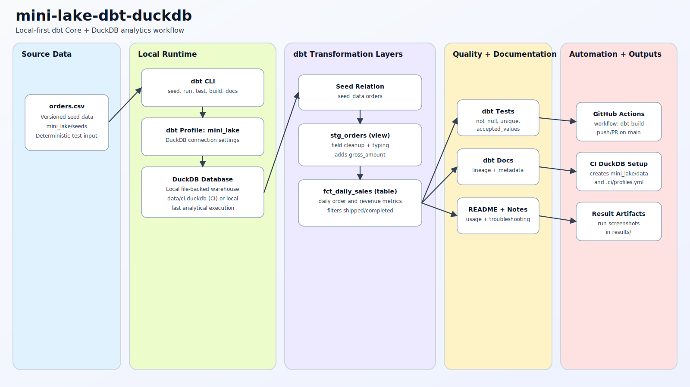

# mini-lake-dbt-duckdb

[](https://github.com/aosman101/mini-lake-dbt-duckdb/actions/workflows/dbt.yml)
[](https://www.python.org/)
[](https://docs.getdbt.com/docs/core)
[](https://duckdb.org/)
[](./LICENSE)

Compact local-first analytics project built with dbt Core + DuckDB. It demonstrates a reproducible seed-to-mart workflow with tests, docs lineage, and CI.

## Architecture



Flow: `orders.csv` seed -> `stg_orders` view -> `fct_daily_sales` table -> dbt tests/docs -> CI validation.

## Project highlights

- Local analytics without external warehouse infrastructure (DuckDB file-backed runtime).
- Deterministic, versioned seed data for repeatable development and CI runs.
- Layered dbt modeling approach (`seed_data` -> staging -> marts).
- Data quality checks in `schema.yml` and automated validation in GitHub Actions.
- Documentation and lineage generation through `dbt docs`.

## Repository layout

- `.github/workflows/dbt.yml`: CI workflow running dbt on push/PR to `main`.
- `.ci/profiles.yml`: CI profile that points dbt to DuckDB.
- `mini_lake/`: dbt project root.
- `mini_lake/seeds/orders.csv`: source seed dataset.
- `mini_lake/models/staging/stg_orders.sql`: typed/cleaned staging model.
- `mini_lake/models/marts/fct_daily_sales.sql`: aggregated daily sales mart.
- `mini_lake/models/schema.yml`: model tests.
- `RUNNING_DBT.md`: extra local run and troubleshooting notes.
- `results/`: terminal run screenshots.

## Data model overview

### `stg_orders` (view)

- Reads from seeded `orders` relation.
- Standardizes order-level fields for downstream models.
- Adds `gross_amount` as `quantity * unit_price`.

### `fct_daily_sales` (table)

- Aggregates records by `order_date`.
- Filters to fulfilled orders (`shipped`, `completed`).
- Produces core daily metrics:
  - `orders`
  - `units`
  - `gross_revenue`
  - `revenue`
  - `net_revenue` (`total_amount - shipping_cost`)

## Quick start

Run from repository root:

```bash
python -m venv .venv
source .venv/bin/activate
python -m pip install --upgrade pip
python -m pip install dbt-core dbt-duckdb duckdb

dbt --project-dir mini_lake seed
dbt --project-dir mini_lake build
dbt --project-dir mini_lake test
dbt --project-dir mini_lake debug
```

Generate docs locally:

```bash
dbt --project-dir mini_lake docs generate
dbt --project-dir mini_lake docs serve
```

## Run exactly like CI

The workflow installs dbt + DuckDB, creates `mini_lake/data/ci.duckdb`, writes `.ci/profiles.yml`, then executes:

```bash
cd mini_lake
dbt build --profiles-dir ../.ci
```

## Data quality and observability

- Tests currently include `not_null`, `unique`, and `accepted_values`.
- CI enforces these checks on every push and pull request targeting `main`.
- `dbt docs generate` provides lineage visibility and column-level metadata.

## License

This project is licensed under the MIT License. See [LICENSE](./LICENSE).
